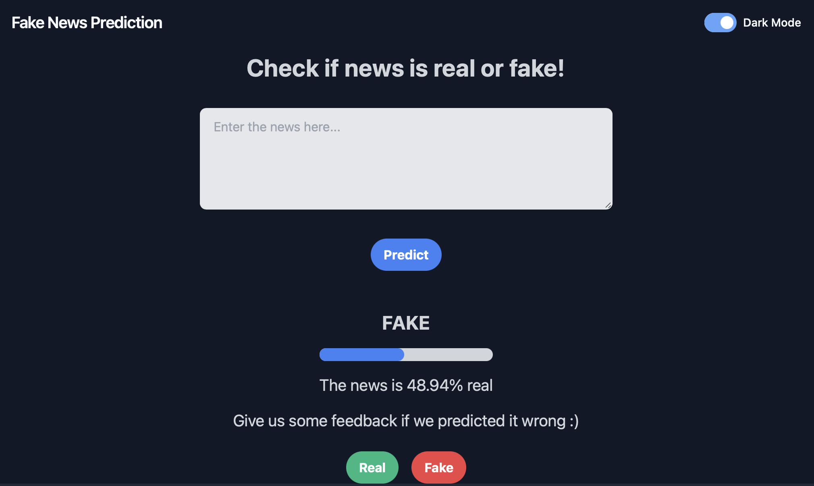

# Fake News Classification: AI Agent & Browser Extension



## 🚀 Project Overview
This project is an **LLM-powered NLP application** designed to identify false or misleading content in real-time. By combining machine learning models with a seamless browser extension, users can verify the integrity of news articles, social media posts, and media files directly from their web browser.

It doesn't just look at text; the system is designed to analyze:
* **Textual Context:** Semantic analysis of news claims.
* **Media Integrity:** Verification of images and videos.
* **Propagation Patterns:** Analyzing how information spreads across social contexts.

---

## 🛠️ Tech Stack

### AI & Machine Learning
* **NLP:** Python-based Natural Language Processing using Jupyter Notebooks.
* **Models:** LLM integration for deep contextual understanding.
* **Client-Side ML:** `TensorFlow.js` for on-device prediction capabilities.

### Extension & Frontend
* **Core:** JavaScript (Manifest V3).
* **Scripts:** `background.js` for process management and `content.js` for DOM manipulation.
* **UI:** Dark mode supported interface for user feedback.

### Backend & Integration
* **Server:** Flask (Python) to handle complex model inference.
* **Communication:** Fetch API for asynchronous client-server integration.

---

## 🏗️ Architecture

The application operates on a hybrid architecture to balance performance and privacy:

1.  **Client-Side (Extension):** Scrapes relevant text/media from the active tab and performs lightweight checks using TensorFlow.js.
2.  **Server-Side (Flask):** Handles heavy-duty LLM processing and complex NLP tasks.
3.  **Feedback Loop:** Users can mark predictions as "Real" or "Fake," allowing for continuous model improvement.


---

## 🚀 Installation & Setup

### 1. Backend Setup
```bash
cd backend
pip install -r requirements.txt
python app.py
